#Ambari 2.1 on Vagrant
##Single cluster with 3 nodes.
This is a step by step installation guide of HDP 2.3 on a multinode cluster.

##Assumptions

- Tested on Mac OSX with 16GB RAM.
- The virtual machines are configured to have CentOS7 and 2 GB RAM each.
- VirtualBox 4.3 was used. 4.x versions are fine. 
- Vagrant is already downloaded.

##Set Up Hosts

Add the following lines to the `/etc/hosts` file.

```
192.168.70.101 ambari1.piyushroutray ambari1
192.168.70.102 ambari2.piyushroutray ambari2
192.168.70.103 ambari3.piyushroutray ambari3
```

##Starting the cluster

- Start the cluster by running `vagrant up` in the folder where the Vagrantfile is present.
- If it fails because of network connectivity issues run `vagrant up` again.
- If it crashes in the middle run `vagrant reload ambari1` to try again. 

##Connecting To Ambari

- Open a web browser and go to <http://ambari1.piyushroutray:8080> for the Ambari web login. 
- Use `admin` as the username and password. This is default.

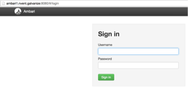

##Name Cluster

- Launch the Install Wizard. 
- Name your cluster.

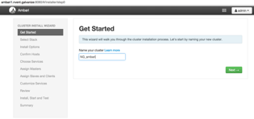


##Select Stack

- Select HDP 2.3 as the Hadoop Stack

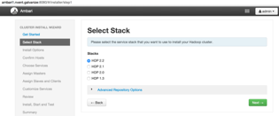

##Select Install Options

- Specify the hostnames:

```
ambari1.piyushroutray
ambari2.piyushroutray
ambari3.piyushroutray
ambari4.piyushroutray
```

- Select the private key `id_rsa` provided in this folder.
- Make sure you choose `id_rsa` not `id_rsa.pub`.

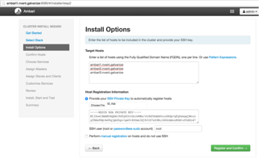

##Confirm Hosts

- Confirm the hosts.
- This should work if the same private key present on all the hosts in the cluster.

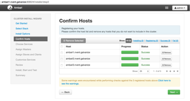

##Choose Services

- Next, select the services you will run on the cluster.
- By default all the services will be selected. 
	- Unselect all of them.
- Then select HDFS, YARN + MapReduce2, Hive, and Ambari Metrics.

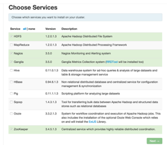

- Say **yes** to all the suggested services. These are needed to run the
services that you have selected.

##Assign Master Nodes

- Choose the default selection for which service to run where.

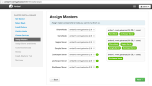

##Assign Slave and Client Nodes

- Accept the defaults and continue.

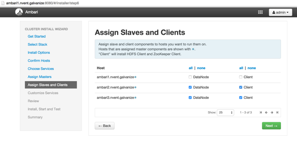

##Customize Services

- Next we customize services. 
- This includes setting up passwords, choosing databases, setting up
emails etc.
- Ambari will show you a red alert badge next to Hive. Drill down into
it. The alert is because Hive needs a password.

Set `myhive` as the Hive password. 

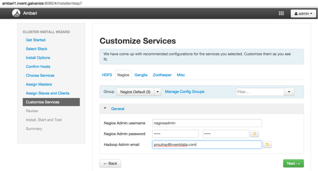

##Start Install

- Review your choices, and then proceed with the install.
- This will take about some time depending on your internet connection.

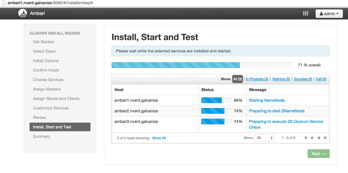

##Install Success!

- If the install was successful you should see a summary page.

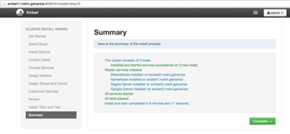

##Land on the Home Page

- When you click on **Complete** you will go to the main Ambari home page.

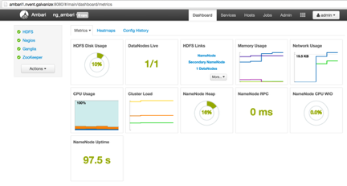

- Here you can add and remove services in the future.
